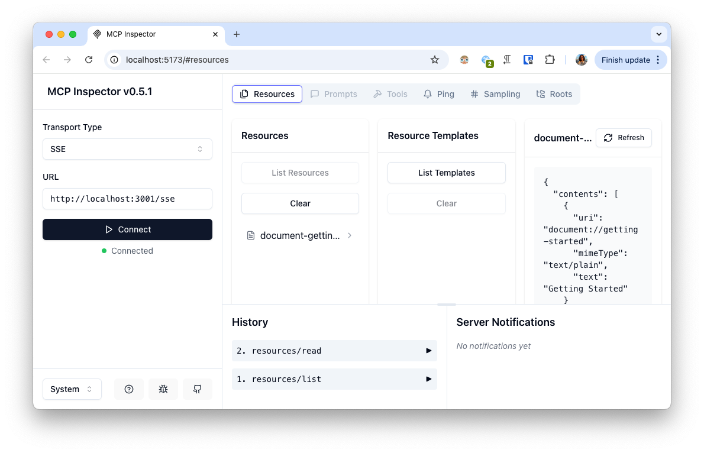

# Example MCP SSE Server

A Model Context Protocol (MCP) server implementation, enabling server-sent events (SSE) based communication.

## Overview

Example MCP SSE Server provides a Model Context Protocol implementation that allows for real-time communication using Server-Sent Events (SSE).
It's designed to work with applications and provides a standardized way of managing and communicating with models and resources.

## Features

- Model Context Protocol (MCP) implementation
- Server-Sent Events (SSE) for real-time communication
- Resource templating and management

## Prerequisites

- Node.js (v14 or higher recommended)
- Yarn package manager (can be changed easily)

## Installation

Clone the repository and install dependencies:

```bash
git clone git@github.com:yunusemredilber/express-mcp-sse-server.git
cd express-mcp-sse-server
yarn install
```

## Usage

### Starting the Server

To start the server in development mode:

```bash
yarn dev
```

This will run the server with the MCP inspector for debugging.



To start the server in production mode:

```bash
yarn start
```

By default, the server runs on port 3001. You can override this by setting the `PORT` environment variable:

```bash
PORT=5000 yarn start
```

### Endpoints

- `/sse` - SSE endpoint for establishing persistent connections
- `/messages` - Endpoint for sending messages to the MCP server

## Project Structure

- `src/index.ts` - Main entry point of the application
- `src/mcp-server.ts` - Implementation of the MCP server and resource definitions
- `src/sse-server.ts` - SSE server implementation using Express

## Dependencies

- [@modelcontextprotocol/sdk](https://www.npmjs.com/package/@modelcontextprotocol/sdk) - SDK for Model Context Protocol
- [Express](https://expressjs.com/) - Web framework for Node.js
